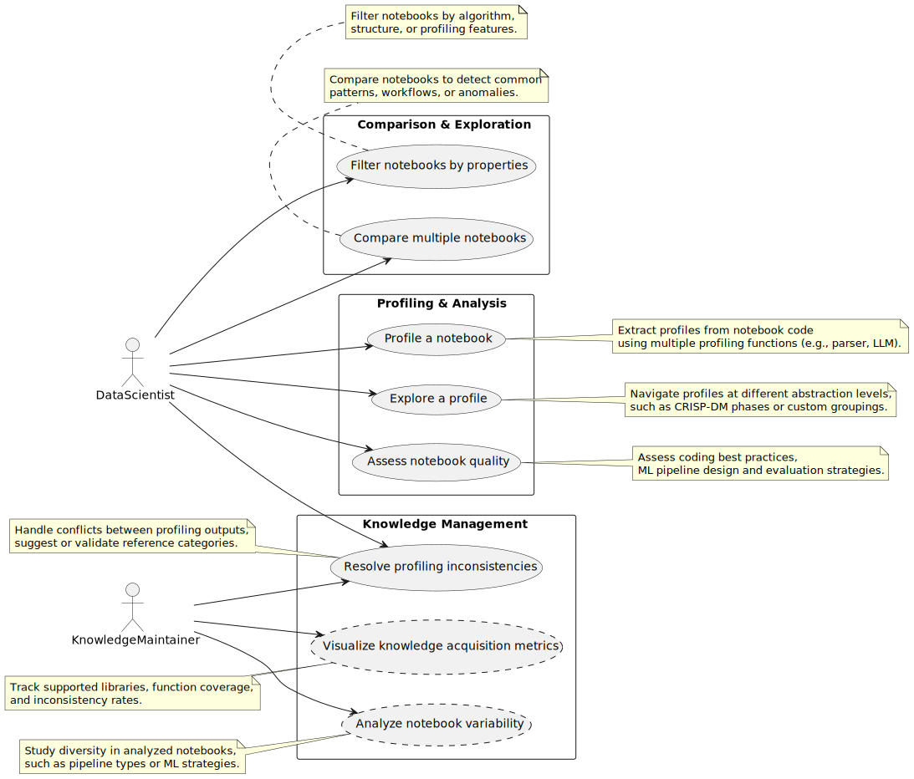

## Project Overview: Profiling and Evaluation of Notebooks

## Objectives
The system aims to support the following primary goals:
Profiling individual notebooks by assigning meaningful categories to code instructions based on customizable taxonomies and multiple profiling techniques (e.g., static analysis, LLM-based analysis).
Exploring profiles at various abstraction levels, from low-level code blocks to high-level phases (e.g., CRISP-DM phases).
Assessing notebook quality, including:
Code best practices,
Coherence and structure of the ML pipeline,
Specific traits like evaluation strategies, algorithm comparison, or the presence of remediation algorithms.
Analyzing notebook corpora to detect common patterns, filter by specific properties, and understand diversity across notebooks.
Resolving profiling inconsistencies when multiple profilers disagree allowing human intervention or automatic resolution to improve profile reliability.
Tracking knowledge acquisition, such as function coverage, supported libraries, and remaining profiling gaps.

## Use Case Diagram Summary
The following use case diagram illustrates the main functionalities of the system, structured into three core subsystems.

1. **Profiling & Analysis**  
   - Profile a notebook: Generate structured profiles from notebook code using multiple profiling functions.
   - Explore a profile: Navigate and visualize profiles at various levels of abstraction.
   - Assess notebook quality: Evaluate the notebook regarding code quality, pipeline integrity, and analysis design.  
   

2. **Comparison & Exploration** 
   - Compare multiple notebooks: Match and analyze notebooks to identify structural or algorithmic similarities.
   - Filter notebooks by properties: Search notebooks by features such as algorithm usage or pipeline type.  
   
   
3. **Knowledge Management**
   - _Resolve profiling inconsistencies_: Manually or semi-automatically address conflicts between profiling functions to define a reference profile.
   - _Visualize knowledge acquisition metrics_: Track the profiling system's growth, such as library coverage and consistency statistics.
   - _Analyze notebook variability_: Study the diversity of analyzed notebooks to support new feature discovery.

Each subsystem supports daily data science tasks and long-term system improvement, balancing usability and extensibility.

Note: The Knowledge Management features are currently being developed and are part of our active research efforts.

## Terminology and Models
The terminology used in this project is defined in the [Terminology](terminology.md) page.

The metamodel for the MLProfile format is encore en développement and will be documented in the future. 
It is currently being implemented in the codebase, and first versions of the metamodel are available in the repository of deliverable L0.2.

## Experimental Toolchain for Profiling and Evaluation
We developed a [proof-of-concept implementation](https://github.com/NicolasLacroix/profil-platform-poc) to tackle the core challenges identified—such as 
the contextual ambiguity of code, 
the fast-paced evolution of ML libraries, 
and the need for scalable, trustworthy profiling. 
This POC aims to validate our hybrid approach, which combines deterministic parsing and LLM-based profiling. 
It provides a functional base to experiment with automated profiling, quality assessment, inconsistency management, and early-stage visualization 
while testing how these components can support individual notebook analysis and large-scale comparative studies.

